# Preparations Guide

Dear Students

Welcome to the online class Worldbuilding technologies! You have received the kit from us. Also note: we have washed/disinfected hands before touching/packaging these, but if you are concerned about virus spread you can wash your hands after handling the components.

Please complete this guide before we start the online course.

---
# 1. Checking your Kit

By now you should have gotten your workshop kit. The first thing to do is make sure you have everything.

Open up the kit and identify the following components:

* 2x rolls of steel conductive thread
* 1x roll of copper conductive thread
* piece of neoprene
* piece of neoprene with conductive fabric strips
* 1x roll of normal thread
* 2x sewing needles
* 3x alligator clips (picture has 4)
* 2x sewing needles
* bag of small electronic components
* string
* plain facemask

<fig>
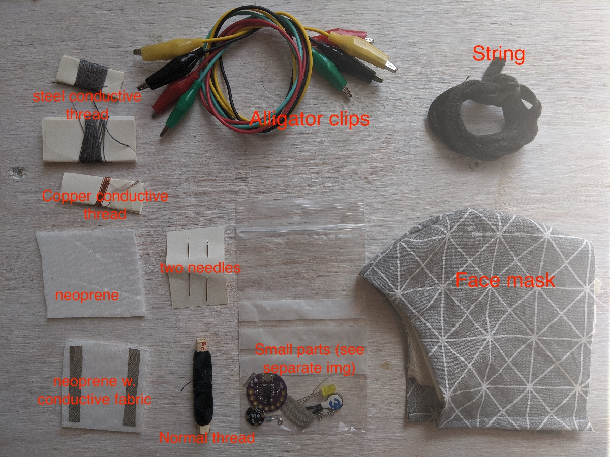<br>
<figcaption>Items in the kit</figcaption>
</fig><br>

Next examine the bag of small electronic components and identify the following:


* 2x 10k𝛀 resistors (with rolled leads)
* LilyPad ATTINY85 development board
* plain old LED (could be red, yellow or green)
* 1x 200𝛀 resistor (straight leads)
* vibration motor
* light sensor LDR (rolled leads)
* Neopixel Flora RGB LED board
* 1x piece of conductive fabric

<fig>
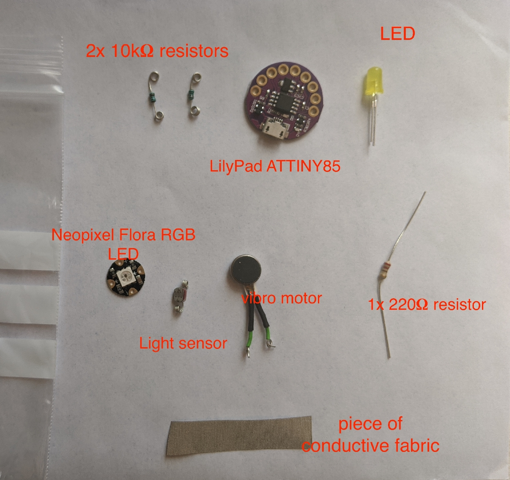<br>
<figcaption>Items inside the small electronic components bag</figcaption>
</fig><br>


In addition to the items in the kit, you should also have the following:
* a pair of scissors
* a [USB micro data transfer cable](https://www.allekabels.nl/data-kabel/14/1286196/usb-micro-b-datakabel.html) (note: it must be a data cable, not just a charging cable)
* optional: [seam ripper](https://www.youtube.com/watch?v=B7tmeBNbZ9c) (for fixing sewing mistakes)
* optional: [USB power bank](https://www.allekabels.nl/powerbank/15477/3223374/powerbank-5000-mah.html) (for powering your mask wirelessly)


---
# 2. Installing Necessary Software

Before the workshop you will need to download and install the Arduino IDE. This software is what you use to create and upload programs to your LilyPad board. Please do this before we start the workshop, and contact us if you have any problems so we can iron those out beforehand and save time.

The installation process has multiple steps and is different depending on your operating system. We assume you are either using a recent version of Windows (8.1 or 10) or an Apple computer with a recent version of OSX. If you're using a flavor of Linux then please contact us.

---
## Windows Pre-installation Steps

***Windows*** users need to first follow these steps before following the more general installation instructions for Mac and Windows below.

Windows users will need to first download and install the DigiStump drivers, which allow your computer to recognize the development board when you plug it in.

If the following instructions aren't completely clear, there is a [video tutorial on YouTube](https://www.youtube.com/watch?v=wq3CuJQLRaw) that might help you with the process.

1. Follow [this download link](https://github.com/digistump/DigistumpArduino/releases/download/1.6.7/Digistump.Drivers.zip) - the link will download a file named `Digistump.Drivers.zip` to your computer.

2. Unzip the contents of the file to your hard drive. It should appear as a folder named `Digistump.Drivers`. Dig into that folder until you find two programs named `DPinst.exe` and `DPinst64.exe` ... these are the driver installation programs. The first one is for 32-bit systems and the second one is for 64-bit systems.

<fig>
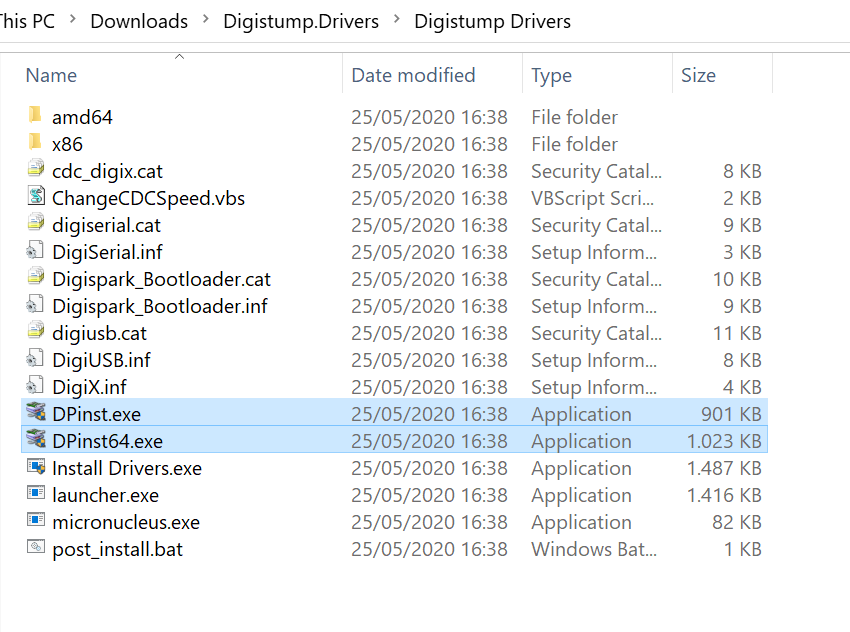<br>
<figcaption>The two installer applications</figcaption>
</fig><br>

3. Run the installer appropriate to your system. Answer `Install/Yes` to any pop-up dialogs.

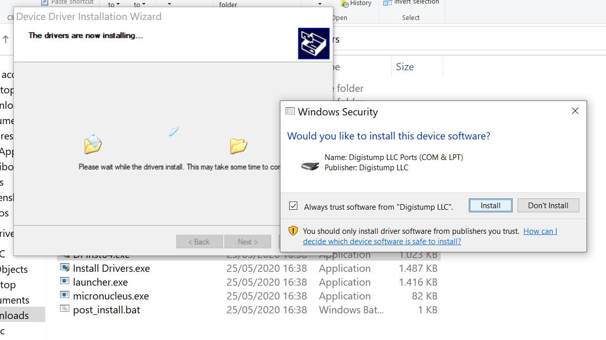<br>

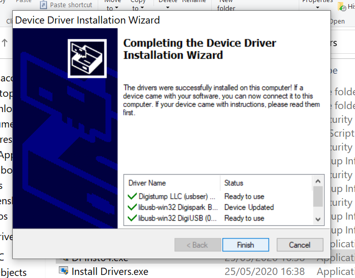<br>

4. Click the `Finish` button once the installation procedure is done.

5. Plug your LilyPad board into your computer using a USB micro data cable. Once you've plugged it in you should see the little red power light on the board turn on.

(NOTE: Have a photo of the board with power light on)

6. Now check to see that Windows recognizes your board. Open up `Device Manager` (you can search for it in the menu bar if you don't know where it is).

  Once you have Device Manager open, scroll down and find an entry named `libusb-win32 devices`. Open up the dropdown triangle and you should see inside a usb device named `Digispark Bootloader`.

<fig>
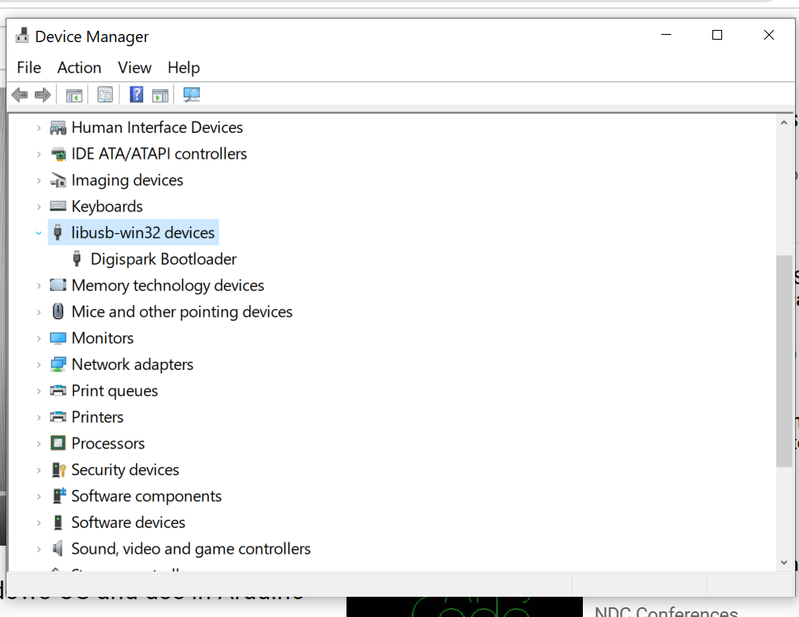<br>
<figcaption>You should see the Digispark Bootloader in Device Manager</figcaption>
</fig><br>

  If you don't have the Digispark Bootloader in Device Manager, make sure your LilyPad is plugged in correctly to your computer. The red power light on the board should be on. You can also try a different USB port on your computer, restarting your computer, or reinstalling the Digistump drivers. If none of that works contact us and let us know.


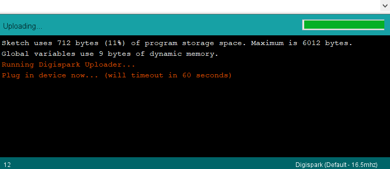<br>


---

## Mac Instructions and Windows Next Steps

The remaining steps for Windows users are identical to the installation instructions for Mac users. Windows users must install the Digistump drivers before following these steps.

1. Download the Arduino IDE from [the Arduino website](https://www.arduino.cc/en/Main/Software). You want to download the IDE, not use the web interface!
2. Install the file you downloaded.

  ***Windows Users*** if you are asked to install drivers, answer Yes to all.

3. Once the installation is finished, run the Arduino IDE. A window should open that looks something like this:

<fig>
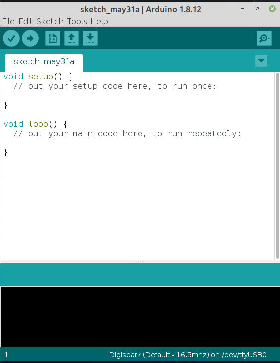
<figcaption>The Arduino IDE</figcaption>
</fig><br>

4. Go to `File->Preferences` to open the program preferences window. Near the bottom of the window you should see a field labeled 'Additional Boards Manager URLs', type in the url `http://digistump.com/package_digistump_index.json` and click `OK`.

<fig>
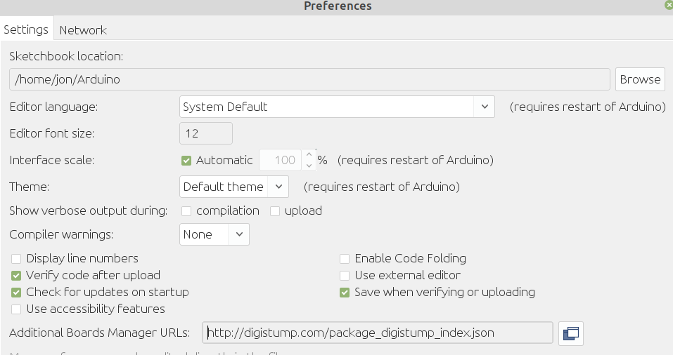
<figcaption>Add the digistump board manager url to your Arduino Preferences</figcaption>
</fig><br>


5. Now go to `Tools->Board` and select `Board Manager` at the top of the boards menu to open up the Board Manager window.

6. Select "Contributed" from the drop-down list of filters and find the package named `Digistump AVR Boards`. This package contains the technical description of your LilyPad board so that the Arduino IDE will know how to program it. Click the install button to download and install this add-on. Wait for the installation to finish.

<fig>
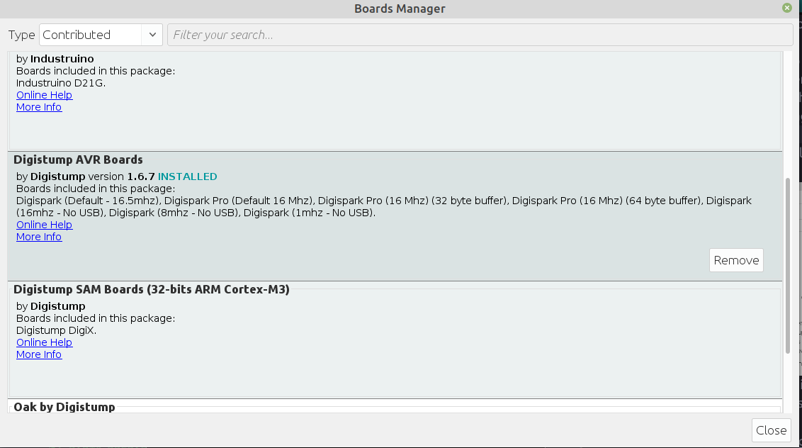
<figcaption>The Digistump AVR Boards package, after installation</figcaption>
</fig><br>


7. When the installation is complete, close the Boards Manager window. Again go to `Tools->Board` and look through the available development boards. If you scroll down you should see a board named `Digispark  (Default - 16.5mhz)`. Select that one.

You're now ready to program your ATTINY85!

---
# 3. Testing that your Installation Works

Now we will test that your installation works and that you can successfully upload a program to the ATTINY85.

We'll use one of the basic examples that makes the LED on the board blink. First, make sure that your board is ***not connected*** to your computer. The process to program these boards is very specific and starts with the USB cable ***unplugged***.

1. First, open the `Start` example found at `File->Examples->Digispark_Examples->Start`

2. Check that you have the correct board selected. Under `Tools->Boards` make sure you have selected `Digispark  (Default - 16.5mhz)`

<fig>
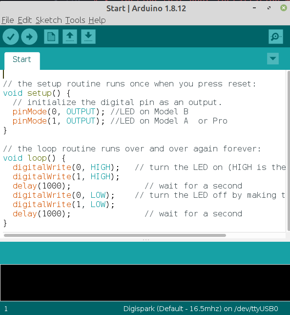
<figcaption>The 'Start' example</figcaption>
</fig><br>


3. Click the ***Arrow*** Button in the upper left to UPLOAD

4. After a moment, you should see some red text in the lower console reading `Running Digispark Uploader... Plug in device now... (will timeout in 60 seconds)`

<fig>

<figcaption>You should see this next in the console after clicking the upload button</figcaption>
</fig><br>

5. The IDE is now waiting for you to plug in your board. Plug it in.

6. After a moment the sketch will be uploaded to your board. You should see some red text showing the upload progress and ending with the line `>> Micronucleus done. Thank you!`.

<fig>
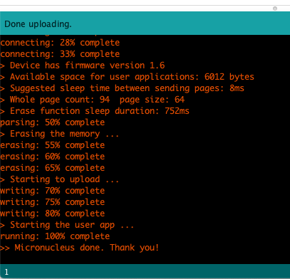
<figcaption>successful program upload message</figcaption>
</fig><br>

7. After successfully programming the board, the little LED should be blinking slowly. If you have problems getting this to work then see the troubleshooting note below.

<fig>
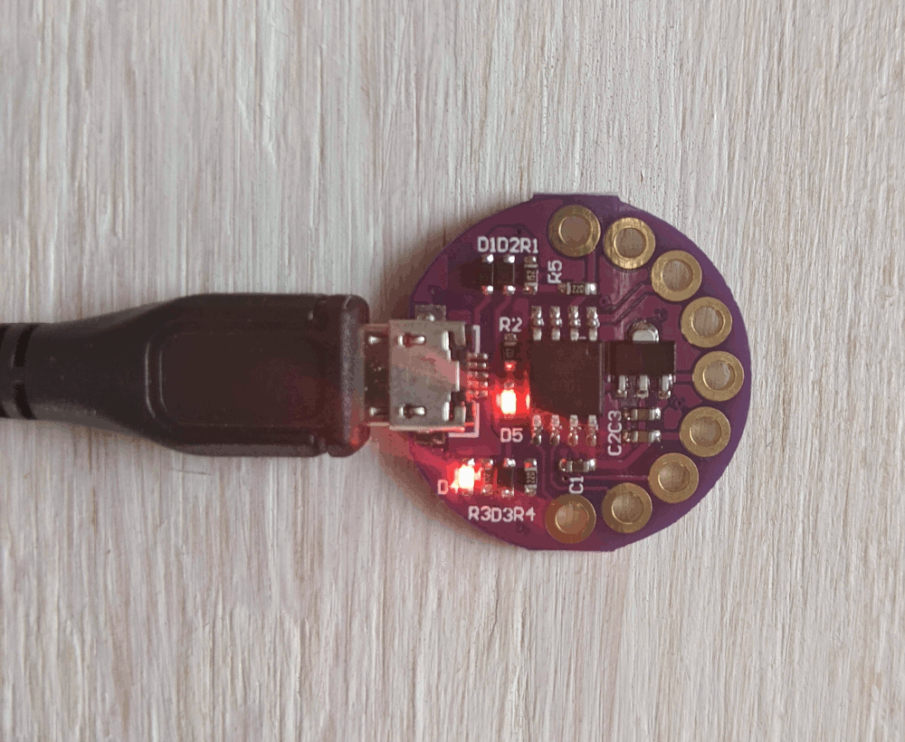
<figcaption>LED blinking program</figcaption>
</fig><br>

# Troubleshooting

The upload process on these boards can be rather fiddly. Sometimes the board isn't detected after plugging it in, sometimes the upload fails inexplicably.

<fig>
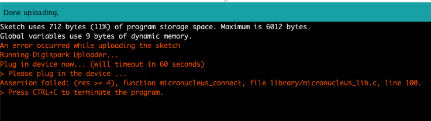
<figcaption>one possible error message</figcaption>
</fig><br>


### General Solution to Errors
In many cases, if an error occurs or your board isn't detected, the solution is to repeat the process:

1. Unplug the USB cable
2. Click on the Upload (Arrow) button again
3. Wait for the console message `Plug in device now...` and then plug in the USB cable.
4. If the programming process is successful, you should see a sequence of messages ending with `>> Micronucleus done. Thank you!`.

If you keep encountering errors, try using a different USB port on your computer.

### Errors when the board is part of a circuit
Programming errors can also be caused by connecting circuits to certain pins of the LilyPad board. But since we haven't built any circuits yet this should not be the cause of programming problems.

### The "bad CPU type in executable" Error
Mac OSX Catalina users might encounter this error when trying to compile the example code for the first time. It happens because Catalina no longer allows you to run 32-bit software. Usually the way to fix this is to "hide" the old 32-bit libraries that the Arduino IDE depends on, so that it instead uses its own internal 64-bit versions.

1. Open up the Terminal - if you don't know how, see: [how to open the Terminal on OSX](https://macpaw.com/how-to/use-terminal-on-mac)
2. Type/copy-paste the following command into the terminal and hit enter:
```
mv ~/Library/Arduino15/packages/arduino/tools/avr-gcc ~/Library/Arduino15/packages/arduino/tools/avr-gcc-old
```
3. Quit the Arduino application if it's open and restart it
