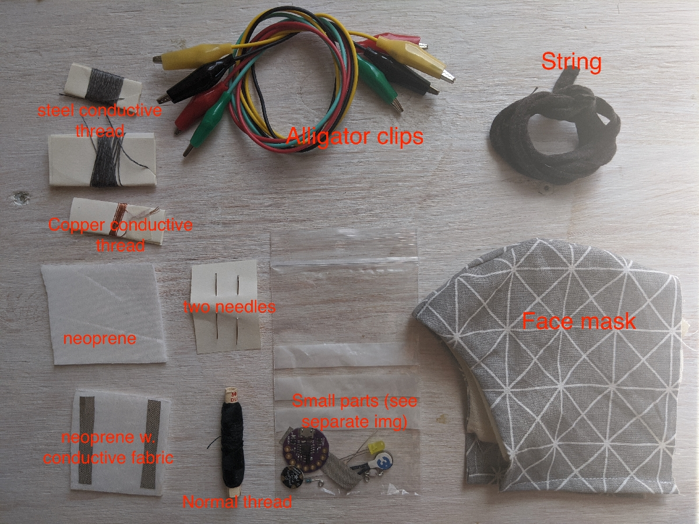
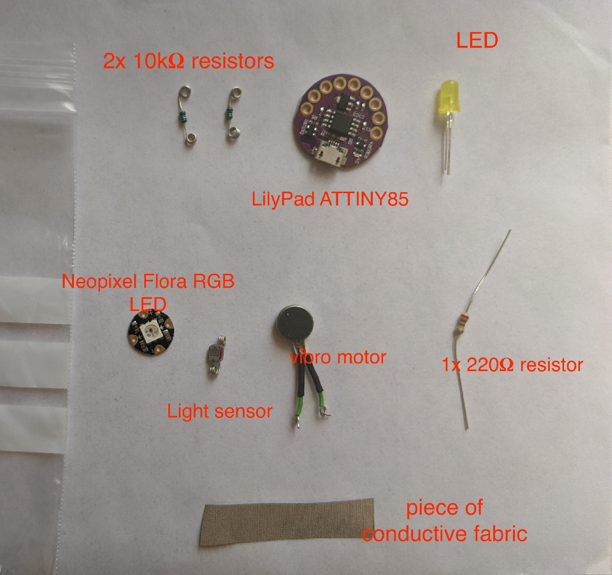
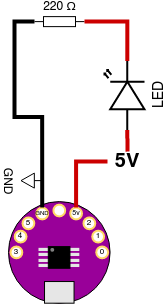

# Getting Started

For this workshop we're using a development board built around the ATTINY85 microcontroller. It's roughly a mixture of two open source designs: the [DigiSpark](http://digistump.com/products/1) and the [Arduino LilyPad](https://www.arduino.cc/en/Main/ArduinoBoardLilyPad/).

# Kit Contents

* 2x rolls of steel conductive thread
* 1x roll of copper conductive thread
* piece of neoprene
* piece of neoprene with conductive fabric strips
* 1x roll of normal thread
* 2x sewing needles
* 3x alligator clips (picture has 4)
* 2x sewing needles
* bag of small electronic components
* string
* plain facemask

<fig>
<br>
<figcaption>Items in the kit</figcaption>
</fig><br>

Next examine the bag of small electronic components and identify the following:


* 2x 10k𝛀 resistors (with rolled leads)
* LilyPad ATTINY85 development board
* plain old LED (could be red, yellow or green)
* 1x 200𝛀 resistor (straight leads)
* vibration motor
* light sensor LDR (rolled leads)
* Neopixel Flora RGB LED board
* 1x piece of conductive fabric

<fig>
<br>
<figcaption>Items inside the small electronic components bag</figcaption>
</fig><br>


In addition to the items in the kit, you should also have the following:
* a pair of scissors
* a [USB micro data transfer cable](https://www.allekabels.nl/data-kabel/14/1286196/usb-micro-b-datakabel.html) (note: it must be a data cable, not just a charging cable)
* optional: [seam ripper](https://www.youtube.com/watch?v=B7tmeBNbZ9c) (for fixing sewing mistakes)
* optional: [USB power bank](https://www.allekabels.nl/powerbank/15477/3223374/powerbank-5000-mah.html) (for powering your mask wirelessly)


# First Circuit

Before we start sewing circuits together we're going to prototype them using the provided alligator clips. Usually when designing technologies / building circuits / writing code you need to work up from the most basic components, and move upwards in levels of complexity. Once you're confident that the smaller pieces work, you can move up to building more complex systems.

This circuit will light up a LED from the power supplied by your board.

<fig>

<figcaption>The different parts of a Light Emitting Diode</figcaption>
</fig>

<br><br>

Connect the board to a power source (USB power or computer) and connect a LED and 220 ohm resistor as shown. The 220 ohm resistor has the color code RED RED BROWN.


The LED should light up.

<fig>

<figcaption>LED Circuit Diagram</figcaption>
</fig>
<br>
<br>


# What's Going on Here?

## Ohm's Law

<fig>

<figcaption>Ohm's Law illustration by Forrest Mims</figcaption>
</fig>

<br><br>

<fig>

<figcaption>Ohm's Law triangle, cover the quantity you are solving for and the rest of the triangle is the relationship</figcaption>
</fig>

<br><br>


## Circuit Symbols and Schematics

<fig>

<figcaption>Some common circuit symbols</figcaption>
</fig>

<br><br>


<fig>

<figcaption>A basic electrical circuit, showing the direction of electron movement (current) through a resistor and switch</figcaption>
</fig>

<br><br>

## Reading Resistance Codes

<fig>

<figcaption>Reading resistor values from band colors</figcaption>
</fig>


# Controlling the Led with Code

Now connect the flat end, or cathode, of the LED to pin 1 instead of the 5V pin.

This is an input/output (I/O) pin that you can control directly by writing code. Instead of constantly supplying 5V to the LED from the 5V pin, we're going to use a program (called a "Sketch") to make the LED blink once a second.


<fig>

<figcaption>LED Control Circuit</figcaption>
</fig>

```
void setup() {               
  pinMode(1, OUTPUT);
}

void loop() {
  digitalWrite(1, 1);
  delay(1000);
  digitalWrite(1, 0);
  delay(1000);
}
```

# First look at C

Arduino programs are written in a programming language called C. C programs follow a sequence of commands, called ***statements***.

Every statement ends with a ***semicolon;***

```
delay(1000);
```

Statements can be grouped together into ***blocks***
You make a block of statements by surrounding them with ***{curly braces}***

```
{
  digitalWrite(1, 1);
  delay(1000);
  digitalWrite(1, 0);
  delay(1000);
}
```

C ***ignores whitespace***. So any spaces, tabs, and new lines you add are really for your own convenience to make the code more readable.

The block of statements below is identical to the one above as far as C is concerned...

```
{digitalWrite(1,1);delay(1000);digitalWrite(1,0);delay(1000);}
```

# Functions and Sections of an Arduino Program

Grouping statements into blocks is useful because it means they can be treated as a whole entity by other commands - for example, if you want to write code that responds to a button pushed, you can use a command to test if the button is pushed or not, and execute one block of statements or another in response.

You can also give names so that they can be referred to anywhere in your program, and so that a useful set of statements can be reused rather than written explicitly each time.

A reusable, named block of statements is called a function.

The Arduino platform depends on you writing two functions:

***setup()*** and ***loop()***

The setup() function runs only once, at the moment when your LilyTiny board is turned on or reset. Thereafter the loop() function runs and repeats endlessly.

The setup() function is where you put commands that configure the board for your sketch. In this case, we configure the behavior of the pins we will be using. We're only using pin 1. And we want to use pin 1 as a digital output to turn the LED on and off. So we use the pinMode() command.

The pinMode() command takes two inputs separately by a comma. The first input is the number of the pin that will be configured. And the second input is the type of configuration. Valid values for the second input of pinMode() are INPUT and OUTPUT (mind the capitalization!).

The loop() function is where you define the ongoing behavior of your device. In this case we use two commands: digitalWrite() and delay() in a specific order to make the LED turn on and off.

The digitalWrite() command sets the value of an output pin to either ON or OFF. In the case of the LilyTiny board, these values always correspond to voltages of +5 and 0 being output by the pin. In your code, an ON value is represented by the number 1, and an OFF value is represented by the number 0. digitalWrite() takes two inputs separated by a comma, the first input is the pin number that you want to control, and the second input is the value (1 or 0) to output on that pin.

The delay() command makes the microcontroller pause for a number of milliseconds. delay() takes only one input, which is the number of milliseconds to pause for, in this case 1000 (1 second).

Try and understand the sequence of commands. Also try changing the number of milliseconds of each delay inside each delay() command, upload the sketch again to your board and see how it changes.

---

# Analog Output

Instead of outputting only ON and OFF, you can also use certain pins to output analog signals. Analog signals are non-binary and can vary smoothly between the two voltage extremes that the LilyTiny can handle (0-5V).

The board generates analog signals using a technique called Pulse Width Modulation (PWM). Only pins 0, 1 and 4 are capable of analog/PWM output.

Now try uploading this sketch to your board. Keep the circuit the same. We are going to use pin 1 as an analog output instead of a digital output to make the LED fade smoothly from darkness to full brightness.

```
int brightness = 0;

void setup() {               
  pinMode(1, OUTPUT);
}

void loop() {
  analogWrite(1, brightness);

  brightness = brightness + 1;

  if(brightness > 255) {
    brightness = 0;
  }

  delay(10);
}
```

## Vibration Motor

The vibration motor intensity can be controlled with PWM (analogWrite) the same way as the LED. It can also be "blinked" on and off (digitalWrite). You can use either of the above LED control sketches to control the vibration motor.

<fig>

<figcaption>The vibration motor circuit</figcaption>
</fig>
