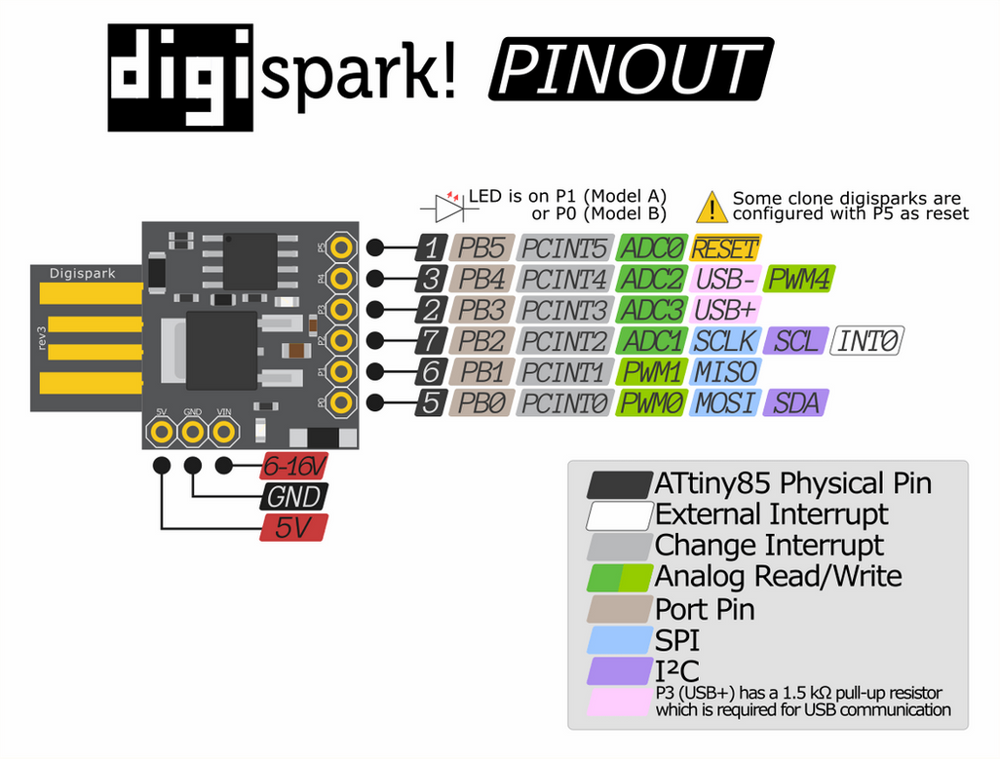
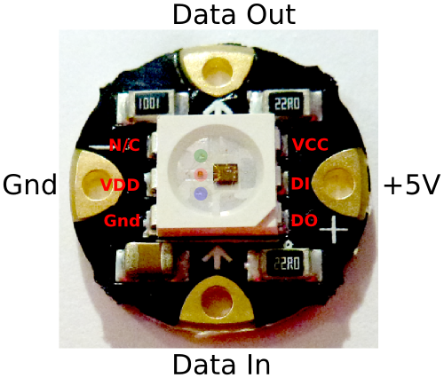
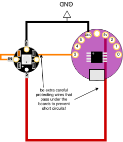

# First Soft Circuit

## Types of Inputs
The most basic sensors are either digital or analog.
The board has a number of digital I/O pins as well as analog input and PWM output pins.

All the data pins for the LilyTiny85:
   All pins can be used as Digital input or digital output.
   Each pin also offers these additional functions:
   Pin 0 → PWM0 (analog output)
   Pin 1 → PWM1 (analog output)
   Pin 2 → ANALOG INPUT A1
   Pin 3 → ANALOG INPUT A3, USB+
   Pin 4 → PWM4 (analog output), ANALOG INPUT A2, USB-)
   Pin 5 → ANALOG INPUT A0, RESET

Additionally, the board has three power pins:
  GND -> Ground Reference Voltage
  Vin -> External power (via battery) must be between 6-16 V
  +5v -> +5V power from the board, use this for powering sensors

> NOTE: Be careful when using PIN 5, since it's the reset button, if you have sensors connected to it you could potentially run into errors trying to program the LilyTiny85.

<br>

<fig>

<figcaption>All pin functions on the LilyTiny85 board</figcaption>
</fig>

<br>


The ATTINY85 LilyPad is a sewable version of the DigiSpark ~ which is a development board based around the ATTINY85 microcontroller.

<fig>

<figcaption>Pin functions of the DigiSpark</figcaption>
</fig>

<br><br>

The ATTINY85 is inexpensive, runs on very low power and can be programmed using the Arduino software toolkit. However, the small size comes with some limitations. Some of the most notable limitations are:
* PIN 5 is the RESET pin on the microcontroller. This means if you connect it to ground, it will reboot your program. In general we leave this pin alone.
* PIN 3 and PIN 4 are used by the USB connection. So connecting certain types of circuit to these pins will make it impossible to reprogram the board using the USB connector.

Because of these limitations, we're going to try and avoid using PIN 3, 4 and especially 5 for now. There are ways of using them, but we're not going to get into that during this workshop.


# Digital Input

<a href="https://www.kobakant.at/DIY/?p=838">All about pull-up resistors and voltage dividers on Kobakant's website.</a>

Notice that the left side of the switch is connected to *TWO* other points: the left side of the resistor and PIN 0 of the LilyTiny board.

<fig>

<figcaption>Digital input (switch) circuit</figcaption>
</fig>
<br />

```
// Blink the on-board LED with a switch input
void setup() {
  pinMode(1, OUTPUT);
  pinMode(0, INPUT);    // configure pin 0 to be a digital input
}

void loop() {
  int button_value = 0;
  button_value = digitalRead(0);
  digitalWrite(1, button_value);
  delay(10); // delay for stability
}
```


## Connecting Neopixel Digitally-controlled LEDs

<fig>

<figcaption>The flora neopixel, a little digitally-controlled RGB LED on a sewable PCB. Too connect it, provide power on the GND and +5V pins, and connect one of the digital outputs from your microcontroller to the DATA IN pin.</figcaption>
</fig>

<fig>

<figcaption>Wiring to control digitally addressable LEDs like the neopixel. These LEDs can be chained, by connecting the OUT pin from one to the IN pin of the next one. Each one can be independently controlled in your code.</figcaption>
</fig>

<br>

The neopixel needs some extra code. You need to import a special library to be able to control it. And use the functions and datatypes inside that library to make things happen.

<br>

```
#include <Adafruit_NeoPixel.h>

int PIX_PIN = 3;      // neopixel pin
int NUM_PIXELS = 1;   // the number of neopixels attached

Adafruit_NeoPixel pixels = Adafruit_NeoPixel(NUM_PIXELS, PIX_PIN, NEO_RGB + NEO_KHZ800);

void setup() {  
  pixels.begin();
}

void loop() {
  pixels.setPixelColor(0, 0); // turn off pixel 0
  pixels.show(); // update the pixel display

  // each color value goes from 0-255, in the order RBG
  pixels.setPixelColor(0, pixels.Color(255, 0, 0));
  pixels.show();
  delay(500); // pause half a second

  // The same, but blue
  pixels.setPixelColor(0, pixels.Color(0, 255, 0));
  pixels.show();
  delay(500);

  // The same, but green
  pixels.setPixelColor(0, pixels.Color(0, 0, 255));
  pixels.show();
  delay(500);

  // Red + Green
  pixels.setPixelColor(0, pixels.Color(255, 255, 0));
  pixels.show();
  delay(500);

  // Red + Blue
  pixels.setPixelColor(0, pixels.Color(255, 0, 255));
  pixels.show();
  delay(500);

   // Green + Blue
  pixels.setPixelColor(0, pixels.Color(0, 255, 255));
  pixels.show();
  delay(500);
}
```

## (optional) Fading Using Loops

This sketch uses the same circuit, but introduces a new programming concept: the loop. There are a few different kinds of looping commands, but probably the most common is the for loop. Here we use a for loop to incrementally increase the brightness of each color of the neopixel with each loop.

```
#include <Adafruit_NeoPixel.h>
#import <math.h>

int PIX_PIN = 3;
int NUM_PIXELS = 1;

Adafruit_NeoPixel pixels = Adafruit_NeoPixel(NUM_PIXELS, PIX_PIN, NEO_RGB + NEO_KHZ800);

void setup() {  
  pixels.begin();
}

void loop() {
  int i; // a counter variable we will use in the for loop

  // shut off the pixel
  pixels.setPixelColor(0, 0);
  pixels.show();

  // Fade in red with a for loop. i counts from 0-255
  for(i=0; i<=255; i++) {
    pixels.setPixelColor(0, pixels.Color(i, 0, 0));
    pixels.show();
    delay(1); // a tiny delay
  }

  // Fade in green, keep red at 255
  for(i=0; i<=255; i++) {
    pixels.setPixelColor(0, pixels.Color(255, i, 0));
    pixels.show();
    delay(1);
  }

  // Fade in blue, keep red and green at 255
  for(i=0; i<=255; i++) {
    pixels.setPixelColor(0, pixels.Color(255, 255, i));
    pixels.show();
    delay(1);
  }
}
```

# The Mask Circuit

Everything connected together.

<fig>

<figcaption></figcaption>
</fig>

```
#include <Adafruit_NeoPixel.h>

int VIBRO_PIN = 1;
int SWITCH_PIN = 0;
int PIXEL_PIN = 3;
int NUM_PIXELS = 1;

Adafruit_NeoPixel pixels = Adafruit_NeoPixel(NUM_PIXELS, PIXEL_PIN, NEO_RGB + NEO_KHZ800);

void setup() {
  int i;  
  pinMode(VIBRO_PIN, OUTPUT);
  pinMode(SWITCH_PIN, INPUT);
  pixels.begin(); // initializes the neopixel data pin

  // Do a little test of the Neopixel
  for(i = 0; i < 10; i++) {
    pixels.setPixelColor(0, pixels.Color(255, 255, 255));
    pixels.show();
    delay(100);
    pixels.setPixelColor(0, 0);
    pixels.show();
    delay(100);
  }
}

int color = 1;
int last_switch = 0;

void loop() {
  int switch_value;
  switch_value = digitalRead(SWITCH_PIN);

  if(switch_value == 1) {
    digitalWrite(VIBRO_PIN, 1);

    if(last_switch == 0) {
      if(color == 0)
        pixels.setPixelColor(0, pixels.Color(255, 0, 0));
      else if(color == 1)
        pixels.setPixelColor(0, pixels.Color(0, 255, 0));
      else if(color == 2)
        pixels.setPixelColor(0, pixels.Color(0, 0, 255));
      else
        pixels.setPixelColor(0, 0);

      pixels.show();

      color = color + 1;
      if(color > 3) {
        color = 0;  
      }

    }
  } else {
    digitalWrite(VIBRO_PIN, 0);     
  }

  last_switch = switch_value;

  delay(20);
}
```


# Troubleshooting

The DigiSpark website has some information on troubleshooting their boards. Since the LilyPad ATTINY85 is basically a DigiSpark in a different form factor, all the troubleshooting advice applies.

[digistump.com/wiki/digispark/tutorials/debugging](http://digistump.com/wiki/digispark/tutorials/debugging)
