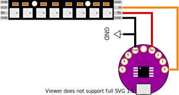

# Getting Started

We're using a physical computing board based on the ATTINY85 microcontroller. It's roughly a mixture of two open source designs: the DigiSpark and the Arduino LilyPad.

## Setting up the IDE
This only applies for Windows/OSX

1. download and install the Arduino IDE https://www.arduino.cc/en/Main/Software
2. Go to File->Preferences and add the following additional board manager url: http://digistump.com/package_digistump_index.json
3. Go to Tools->Board and select Board Manager
4. Select "Contributed" from the drop-down and find the package named "Digistump AVR Boards", click the install button.
5. If any extra windows open up (e.g. on Windows) click "agree" and "next", this will install additional drivers you may need.
6. When the install is complete, close the Board Managers windows. Go to Tools->Boards and select "Digispark  (Default - 16.5mhz)"

You're ready to program your microcontroller!

<fig>

<figcaption>STEP. 2</figcaption>
</fig>

## Uploading a sketch
First see if you can successfully upload a sketch to the board. We'll use one of the basic examples that makes the LED on the board blink.
1. Do not connect your board via USB, you will be asked to do this in a moment.
2. Open the example at File->Examples->Digispark_Examples->Start
2. Under Tools->Boards make sure you have selected "Digispark  (Default - 16.5mhz)"
3. Click the Arrow Button (UPLOAD)
4. After a moment, you should see some red text in the console reading `Running Digispark Uploader... Plug in device now... (will timeout in 60 seconds)`
5. Now plug in your board
4. After a moment the sketch will be uploaded to your board, the little LED should be blinking slowly.

# First Circuit

This circuit lights a LED from the power supplied by your board. Connect the board to a power source (USB power or computer) and connect a LED and 220 ohm resistor as shown. The LED should light up.

<fig>

<figcaption>LED Circuit Diagram</figcaption>
</fig>


<fig>

<figcaption>Reading resistor values from band colors</figcaption>
</fig>


# Controlling the Led with Code

Now connect the flat end, or cathode, of the LED to pin 1 instead of the 5V pin. This is an input/output (I/O) pin that you can control directly by writing code. Instead of constantly supplying 5V to the LED from the 5V pin, we're going to use a program (called a "Sketch") to make the LED blink once a second.


<fig>

<figcaption>LED Control Circuit</figcaption>
</fig>

```
// Blink sketch

void setup() {               
  pinMode(1, OUTPUT);
}

void loop() {
  digitalWrite(1, 1);
  delay(1000);
  digitalWrite(1, 0);
  delay(1000);
}
```

Arduino sketches have two main sections, called "functions". These functions are setup() and loop(). The setup() function runs only once, at the moment when your LilyTiny board is turned on or reset. Thereafter the loop() function runs and repeats endlessly.

The setup() function is where you put commands that configure the board for your sketch. In this case, we configure the behavior of the pins we will be using. We're only using pin 1. And we want to use pin 1 as a digital output to turn the LED on and off. So we use the pinMode() command.

The pinMode() command takes two inputs separately by a comma. The first input is the number of the pin that will be configured. And the second input is the type of configuration. Valid values for the second input of pinMode() are INPUT and OUTPUT (mind the capitalization!).

The loop() function is where you define the ongoing behavior of your device. In this case we use two commands: digitalWrite() and delay() in a specific order to make the LED turn on and off.

The digitalWrite() command sets the value of an output pin to either ON or OFF. In the case of the LilyTiny board, these values always correspond to voltages of +5 and 0 being output by the pin. In your code, an ON value is represented by the number 1, and an OFF value is represented by the number 0. digitalWrite() takes two inputs separated by a comma, the first input is the pin number that you want to control, and the second input is the value (1 or 0) to output on that pin.

The delay() command makes the microcontroller pause for a number of milliseconds. delay() takes only one input, which is the number of milliseconds to pause for, in this case 1000 (1 second).

Try and understand the sequence of commands. Also try changing the number of milliseconds of each delay inside each delay() command, upload the sketch again to your board and see how it changes.

---

## Analog Output

Instead of outputting only ON and OFF, you can also use certain pins to output analog signals. Analog signals are non-binary and can vary smoothly between the two voltage extremes that the LilyTiny can handle (0-5V).

The board generates analog signals using a technique called Pulse Width Modulation (PWM). Only pins 0, 1 and 4 are capable of PWM outputs.

Now try uploading this sketch to your board. Keep the circuit the same. We are going to use pin 1 as an analog output instead of a digital output to make the LED fade smoothly from darkness to full brightness.

```
// Fade sketch

// A variable to store the brightness value
int brightness = 0;  // goes from 0 to 255

void setup() {               
  pinMode(1, OUTPUT);
}

void loop() {
  analogWrite(1, brightness);    // write the value of brightness to the pin
  brightness = brightness + 1;   // add 1 to the brightness value
  delay(10);                     // delay for stability
  if(brightness > 255) {         // this is a conditional (if) statement
    brightness = 0;              // if brightness is greater than 255, reset it to 0
  }
}
```

## Vibration Motor

The vibration motor intensity can be controlled with PWM (analogWrite) the same way as the LED. It can also be "blinked" on and off (digitalWrite). You can use either of the above LED control sketches to control the vibration motor.

<fig>

<figcaption>The vibration motor circuit</figcaption>
</fig>


## Types of Inputs
The most basic sensors are either digital or analog.
The board has a number of digital I/O pins as well as analog input and PWM output pins.

All the data pins for the LilyTiny85:
   All pins can be used as Digital input or digital output.
   Each pin also offers these additional functions:
   Pin 0 → PWM0 (spi MOSI, i2c SDA)
   Pin 1 → PWM1 (spi MISO)
   Pin 2 → ANALOG INPUT (ADC1, spi SCLK, i2c SCL)
   Pin 3 → ANALOG INPUT (ADC3, USB+)
   Pin 4 → PWM4, ANALOG INPUT (ADC2, USB-)
   Pin 5 → ANALOG INPUT (ADC0, RESET)

Additionally, the board has three power pins:
  GND -> Ground Reference Voltage
  Vin -> External power (via battery) must be between 6-16 V
  +5v -> +5V power from the board, use this for powering sensors

> NOTE: Be careful when using PIN 5, since it's the reset button, if you have sensors connected to it you could potentially run into errors trying to program the LilyTiny85.

<fig>

<figcaption>All pin functions on the LilyTiny85 board</figcaption>
</fig>

## Digital Inputs

<a href="https://www.kobakant.at/DIY/?p=838">All about pull-up resistors and voltage dividers on Kobakant's website.</a>

Notice that the left side of the switch is connected to *TWO* other points: the left side of the resistor and PIN 4 of the LilyTiny board.

<fig>

<figcaption>Digital input (button) circuit and vibro motor</figcaption>
</fig>

```
// CONTROL THE VIBRO MOTOR ON PIN 1 USING A BUTTON IN PIN 4

void setup() {
  pinMode(1, OUTPUT);
  pinMode(4, INPUT);    // configure pin 4 to be a digital input
}

void loop() {
  int button_value = 0;
  button_value = digitalRead(4);
  digitalWrite(1, button_value);
  delay(10); // delay for stability
}
```

## Analog Input
Light sensor or other analog input.

<fig>

<figcaption>Connecting a resistive, analog sensor. In this case a light dependent resistor (LDR)</figcaption>
</fig>

## Connecting Neopixel Digitally-controlled LEDs

<fig>

<figcaption>Wiring to control digitally addressable LEDs like neopixel. These LEDs can be chained, adding more and more.</figcaption>
</fig>

## Debugging
digistump.com/wiki/digispark/tutorials/debugging
