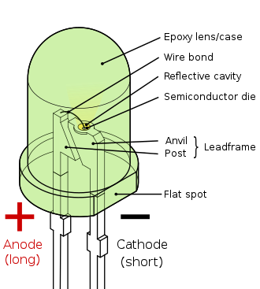
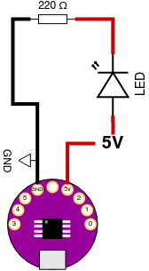
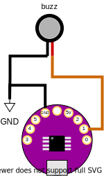
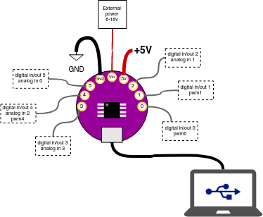
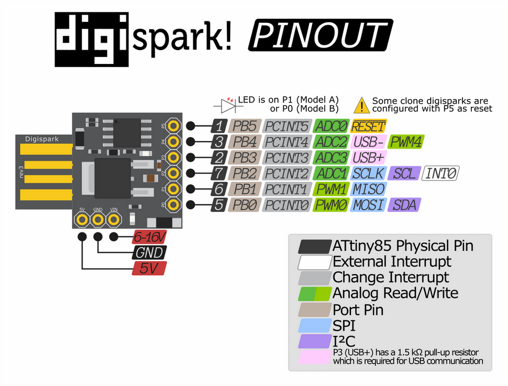
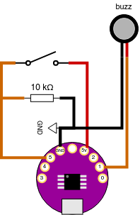
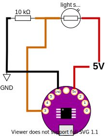
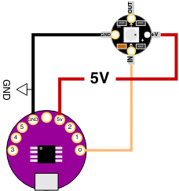
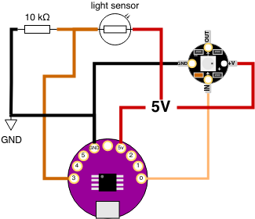

# Getting Started

We're using a physical computing board based on the ATTINY85 microcontroller. It's roughly a mixture of two open source designs: the DigiSpark and the Arduino LilyPad.

## Setting up the IDE
This only applies for Windows/OSX

1. download and install the Arduino IDE https://www.arduino.cc/en/Main/Software
2. Go to File->Preferences and add the following additional board manager url: http://digistump.com/package_digistump_index.json
3. Go to Tools->Board and select Board Manager
4. Select "Contributed" from the drop-down and find the package named "Digistump AVR Boards", click the install button.
5. If any extra windows open up (e.g. on Windows) click "agree" and "next", this will install additional drivers you may need.
6. When the install is complete, close the Board Managers windows. Go to Tools->Boards and select "Digispark  (Default - 16.5mhz)"

You're ready to program your microcontroller!

<fig>

<figcaption>STEP. 2</figcaption>
</fig>

## Uploading a sketch
First see if you can successfully upload a sketch to the board. We'll use one of the basic examples that makes the LED on the board blink.
1. Do not connect your board via USB, you will be asked to do this in a moment.
2. Open the example at File->Examples->Digispark_Examples->Start
2. Under Tools->Boards make sure you have selected "Digispark  (Default - 16.5mhz)"
3. Click the Arrow Button (UPLOAD)
4. After a moment, you should see some red text in the console reading `Running Digispark Uploader... Plug in device now... (will timeout in 60 seconds)`
5. Now plug in your board
4. After a moment the sketch will be uploaded to your board, the little LED should be blinking slowly.

# First Circuit

This circuit lights a LED from the power supplied by your board. Connect the board to a power source (USB power or computer) and connect a LED and 220 ohm resistor as shown. The LED should light up.


<fig>

<figcaption>The different parts of a Light Emitting Diode</figcaption>
</fig>


<fig>

<figcaption>LED Circuit Diagram</figcaption>
</fig>


<fig>

<figcaption>Reading resistor values from band colors</figcaption>
</fig>


# Controlling the Led with Code

Now connect the flat end, or cathode, of the LED to pin 1 instead of the 5V pin. This is an input/output (I/O) pin that you can control directly by writing code. Instead of constantly supplying 5V to the LED from the 5V pin, we're going to use a program (called a "Sketch") to make the LED blink once a second.


<fig>

<figcaption>LED Control Circuit</figcaption>
</fig>

```
// Blink sketch

void setup() {               
  pinMode(1, OUTPUT);
}

void loop() {
  digitalWrite(1, 1);
  delay(1000);
  digitalWrite(1, 0);
  delay(1000);
}
```

Arduino sketches have two main sections, called "functions". These functions are setup() and loop(). The setup() function runs only once, at the moment when your LilyTiny board is turned on or reset. Thereafter the loop() function runs and repeats endlessly.

The setup() function is where you put commands that configure the board for your sketch. In this case, we configure the behavior of the pins we will be using. We're only using pin 1. And we want to use pin 1 as a digital output to turn the LED on and off. So we use the pinMode() command.

The pinMode() command takes two inputs separately by a comma. The first input is the number of the pin that will be configured. And the second input is the type of configuration. Valid values for the second input of pinMode() are INPUT and OUTPUT (mind the capitalization!).

The loop() function is where you define the ongoing behavior of your device. In this case we use two commands: digitalWrite() and delay() in a specific order to make the LED turn on and off.

The digitalWrite() command sets the value of an output pin to either ON or OFF. In the case of the LilyTiny board, these values always correspond to voltages of +5 and 0 being output by the pin. In your code, an ON value is represented by the number 1, and an OFF value is represented by the number 0. digitalWrite() takes two inputs separated by a comma, the first input is the pin number that you want to control, and the second input is the value (1 or 0) to output on that pin.

The delay() command makes the microcontroller pause for a number of milliseconds. delay() takes only one input, which is the number of milliseconds to pause for, in this case 1000 (1 second).

Try and understand the sequence of commands. Also try changing the number of milliseconds of each delay inside each delay() command, upload the sketch again to your board and see how it changes.

---

## Analog Output

Instead of outputting only ON and OFF, you can also use certain pins to output analog signals. Analog signals are non-binary and can vary smoothly between the two voltage extremes that the LilyTiny can handle (0-5V).

The board generates analog signals using a technique called Pulse Width Modulation (PWM). Only pins 0, 1 and 4 are capable of PWM outputs.

Now try uploading this sketch to your board. Keep the circuit the same. We are going to use pin 1 as an analog output instead of a digital output to make the LED fade smoothly from darkness to full brightness.

```
// Fade sketch

// A variable to store the brightness value
int brightness = 0;  // goes from 0 to 255

void setup() {               
  pinMode(1, OUTPUT);
}

void loop() {
  analogWrite(1, brightness);    // write the value of brightness to the pin
  brightness = brightness + 1;   // add 1 to the brightness value
  delay(10);                     // delay for stability
  if(brightness > 255) {         // this is a conditional (if) statement
    brightness = 0;              // if brightness is greater than 255, reset it to 0
  }
}
```

## Vibration Motor

The vibration motor intensity can be controlled with PWM (analogWrite) the same way as the LED. It can also be "blinked" on and off (digitalWrite). You can use either of the above LED control sketches to control the vibration motor.

<fig>

<figcaption>The vibration motor circuit</figcaption>
</fig>


## Types of Inputs
The most basic sensors are either digital or analog.
The board has a number of digital I/O pins as well as analog input and PWM output pins.

All the data pins for the LilyTiny85:
   All pins can be used as Digital input or digital output.
   Each pin also offers these additional functions:
   Pin 0 → PWM0 (spi MOSI, i2c SDA)
   Pin 1 → PWM1 (spi MISO)
   Pin 2 → ANALOG INPUT (ADC1, spi SCLK, i2c SCL)
   Pin 3 → ANALOG INPUT (ADC3, USB+)
   Pin 4 → PWM4, ANALOG INPUT (ADC2, USB-)
   Pin 5 → ANALOG INPUT (ADC0, RESET)

Additionally, the board has three power pins:
  GND -> Ground Reference Voltage
  Vin -> External power (via battery) must be between 6-16 V
  +5v -> +5V power from the board, use this for powering sensors

> NOTE: Be careful when using PIN 5, since it's the reset button, if you have sensors connected to it you could potentially run into errors trying to program the LilyTiny85.

<fig>

<figcaption>All pin functions on the LilyTiny85 board</figcaption>
</fig>

The ATTINY85 LilyPad is a sewable version of the DigiSpark ~ which is a development board based around the ATTINY85 microcontroller.

<fig>

<figcaption>Pin functions of the DigiSpark</figcaption>
</fig>

The ATTINY85 is great because it's very inexpensive, runs on very low power and can be programmed using the Arduino software toolkit. However, the small size comes with some limitations. Some of the most notable limitations are:
* PIN 5 is the RESET pin on the microcontroller. This means if you connect it to ground, it will reboot your program.
* PIN 2 and PIN 3 are used by the USB connection. So if you use these pins in your circuit, you will be unable to reprogram the board using the USB connector.

Because of these limitations, we're going to avoid using PIN 2, 3 and 5 for now. There are ways of using them, but we're not going to get into that during this workshop.

## Digital Inputs

<a href="https://www.kobakant.at/DIY/?p=838">All about pull-up resistors and voltage dividers on Kobakant's website.</a>

Notice that the left side of the switch is connected to *TWO* other points: the left side of the resistor and PIN 4 of the LilyTiny board.

<fig>

<figcaption>Digital input (button) circuit and vibro motor</figcaption>
</fig>

```
// CONTROL THE VIBRO MOTOR ON PIN 1 USING A BUTTON IN PIN 4

void setup() {
  pinMode(1, OUTPUT);
  pinMode(4, INPUT);    // configure pin 4 to be a digital input
}

void loop() {
  int button_value = 0;
  button_value = digitalRead(4);
  digitalWrite(1, button_value);
  delay(10); // delay for stability
}
```

## Analog Input
Light sensor or other analog input.

Leave the vibro motor connected as it is and try building this circuit with the light sensor.

<fig>

<figcaption>Connecting a resistive, analog sensor. In this case a light dependent resistor (LDR)</figcaption>
</fig>

```
#define VIB_PIN           1   // vib motor / PWM and built-in led
#define AN_PIN            3   // one of the analog inputs

void setup() {  
  pinMode(VIB_PIN, OUTPUT);       // connect a vibro motor or LED
  pinMode(AN_PIN, INPUT);         // connect an analog sensor here, like a LDR
}


void loop() {
  int an_sig, mapped; // define some integer variables that we will use below

  an_sig = analogRead(AN_PIN); // read analog sensor
  delay(5); // small delay for stability

  // usually you need to use the map() and constrain() functions
  // to convert the range of the analog sensor to a range of values that you can use
  // Here the functions are "nested". The innermost function (map) is the first one to execute.
  // The result of this function then is passed to the outer function (constrain)
  // Here we map the analog sensor value from a range of 475-605 to 0-255
  // However, if the analog signal is outside the range of 475-605 then map
  //  will give us a result outside the range of 0-255. This can happen because
  //  analog sensors are often tempramental and inexact.
  // To deal with this, we use constrain to clamp the mapped value to 0-255.
  mapped = constrain(map(an_sig, 475, 605, 0, 255), 0, 255);

  // use the mapped analog value to control the vibro motor strength
  analogWrite(VIB_PIN, mapped);

  // small delay for stability
  delay(5);
}
```


## Connecting Neopixel Digitally-controlled LEDs

<fig>

<figcaption>The flora neopixel, a little digitally-controlled RGB LED on a sewable PCB. Too connect it, provide power on the GND and +5V pins, and connect one of the digital outputs from your microcontroller to the DATA IN pin.</figcaption>
</fig>

<fig>

<figcaption>Wiring to control digitally addressable LEDs like the neopixel. These LEDs can be chained, by connecting the OUT pin from one to the IN pin of the next one. Each one can be independently controlled in your code.</figcaption>
</fig>

The neopixel needs some extra code. You need to import a special library to be able to control it. And use the functions and datatypes inside that library to make things happen.

```
// Import the Neopixel library
#include <Adafruit_NeoPixel.h>
#import <math.h>

#define PIX_PIN           0   // neopixel pin
#define NUM_PIXELS        1   // the number of neopixels attached, increase this if you chain a few of them together

Adafruit_NeoPixel pixels = Adafruit_NeoPixel(NUM_PIXELS, PIX_PIN, NEO_RGB + NEO_KHZ800);

void setup() {  
  pixels.begin();
}

void loop() {
  pixels.setPixelColor(0, 0); // send command to turn off pixel 0
  pixels.show(); // update the pixel display with your commands

  // Tell the pixel at address 0 you want it to turn red (red, blue, green)
  // each color value goes from 0-255
  pixels.setPixelColor(0, pixels.Color(255, 0, 0));
  pixels.show(); // update the neopixel
  delay(500); // pause half a second

  // The same, but blue
  pixels.setPixelColor(0, pixels.Color(0, 255, 0));
  pixels.show();
  delay(500);

  // The same, but green
  pixels.setPixelColor(0, pixels.Color(0, 0, 255));
  pixels.show();
  delay(500);

  // Red + Green
  pixels.setPixelColor(0, pixels.Color(255, 255, 0));
  pixels.show();
  delay(500);

  // Red + Blue
  pixels.setPixelColor(0, pixels.Color(255, 0, 255));
  pixels.show();
  delay(500);

   // Green + Blue
  pixels.setPixelColor(0, pixels.Color(0, 255, 255));
  pixels.show();
  delay(500);
}
```

## Fading Using Loops
This sketch uses the same circuit, but introduces a new programming concept: the loop. There are a few different kinds of looping commands, but probably the most common is the for loop. Here we use a for loop to incrementally increase the brightness of each color of the neopixel with each loop.

```
#include <Adafruit_NeoPixel.h>
#import <math.h>

#define PIX_PIN           0   // neopixel pin
#define NUM_PIXELS        1   // the number of neopixels attached, increase this if you chain a few of them together

Adafruit_NeoPixel pixels = Adafruit_NeoPixel(NUM_PIXELS, PIX_PIN, NEO_RGB + NEO_KHZ800);

void setup() {  
  pixels.begin();
}

void loop() {
  int i; // a counter variable we will use in the for loop

  pixels.setPixelColor(0, 0); // send command to turn off pixel 0
  pixels.show(); // update the pixel display with your commands


  // Fade in red with a for loop. i counts from 0-255
  for(i=0; i<=255; i++) {
    pixels.setPixelColor(0, pixels.Color(i, 0, 0));
    pixels.show();
    delay(1); // a tiny delay
  }


  // Fade in green, keep red at 255
  for(i=0; i<=255; i++) {
    pixels.setPixelColor(0, pixels.Color(255, i, 0));
    pixels.show();
    delay(1);
  }

  // Fade in blue, keep red and green at 255
  for(i=0; i<=255; i++) {
    pixels.setPixelColor(0, pixels.Color(255, 255, i));
    pixels.show();
    delay(1);
  }
}
```


## Controlling the Neopixel with the LDR
Use the LDR to control the blinking speed of the neopixel.

<fig>

<figcaption>LED input + Neopixel output circuit.</figcaption>
</fig>

```
#include <Adafruit_NeoPixel.h>

#define PIX_PIN           0   // neopixel data pin
#define AN_PIN            3   // analog sensor input pin
#define NUM_PIXELS        1   // number of neopixels attached

Adafruit_NeoPixel pixels = Adafruit_NeoPixel(NUM_PIXELS, PIX_PIN, NEO_RGB + NEO_KHZ800);

void setup() {  
  pinMode(AN_PIN, INPUT);
  pixels.begin();
}

int speed_ms = 100; // global variable for blink speed

void loop() {
  int analog_value;
  analog_value = analogRead(AN_PIN);
  delay(2); // quick delay for stability

  // map/constrain the analog value to a delay time in ms
  speed_ms = constrain(map(analog_value, 447, 605, 50, 1000), 50, 1000);

  // red
  pixels.setColor(0, pixels.Color(255,0,0));
  pixels.show();

  delay(speed_ms);

  // blue
  pixels.setColor(0, pixels.Color(0,255,0));
  pixels.show();

  delay(speed_ms);

  // green
  pixels.setColor(0, pixels.Color(0,0,255));
  pixels.show();

  delay(speed_ms);
}
```


## Debugging
digistump.com/wiki/digispark/tutorials/debugging
