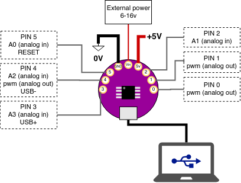

# Getting Started

We're using a physical computing board based on the ATTINY85 microcontroller. It's roughly a mixture of two open source designs: the DigiSpark and the Arduino LilyPad.

## Setting up the IDE
This only applies for Windows/OSX

1. download and install the Arduino IDE https://www.arduino.cc/en/Main/Software
2. Go to File->Preferences and add the following additional board manager url: http://digistump.com/package_digistump_index.json
3. Go to Tools->Board and select Board Manager
4. Select "Contributed" from the drop-down and find the package named "Digistump AVR Boards", click the install button.
5. If any extra windows open up (e.g. on Windows) click "agree" and "next", this will install additional drivers you may need.
6. When the install is complete, close the Board Managers windows. Go to Tools->Boards and select "Digispark  (Default - 16.5mhz)"

You're ready to program your microcontroller!

<fig>

<figcaption>STEP. 2</figcaption>
</fig>

## Uploading a sketch
First see if you can successfully upload a sketch to the board. We'll use one of the basic examples that makes the LED on the board blink.
1. Do not connect your board via USB, you will be asked to do this in a moment.
2. Open the example at File->Examples->Digispark_Examples->Start
2. Under Tools->Boards make sure you have selected "Digispark  (Default - 16.5mhz)"
3. Click the Arrow Button (UPLOAD)
4. After a moment, you should see some red text in the console reading `Running Digispark Uploader... Plug in device now... (will timeout in 60 seconds)`
5. Now plug in your board
4. After a moment the sketch will be uploaded to your board, the little LED should be blinking slowly.

# First Circuit

This circuit lights a LED from the power supplied by your board. Connect the board to a power source (USB power or computer) and connect a LED and 220 ohm resistor as shown. The LED should light up.

<fig>

<figcaption>LED Circuit Diagram</figcaption>
</fig>


<fig>

<figcaption>Reading resistor values from band colors</figcaption>
</fig>


# Programmable Led Blink and Glow

<fig>

<figcaption>LED Control Circuit</figcaption>
</fig>

```
// Blink sketch

void setup() {               
  pinMode(1, OUTPUT);
}

void loop() {
  digitalWrite(1, 1);
  delay(1000);
  digitalWrite(1, 0);
  delay(1000);
}
```


```
// Fade sketch
int brightness = 0;  // goes from 0 to 255

void setup() {               
  pinMode(1, OUTPUT);
}

void loop() {
  analogWrite(1, brightness);
  brightness = brightness + 1;
  delay(10);
  if(brightness > 255) {
    brightness = 0;
  }
}
```

## Vibration Motor

The vibration motor intensity can be controlled with PWM (analogWrite) the same way as the LED. It can also be "blinked" on and off (digitalWrite). You can use either of the above LED control sketches to control the vibration motor.

<fig>

<figcaption>The vibration motor circuit</figcaption>
</fig>


## Types of Inputs
The most basic sensors are either digital or analog.
The board has a number of digital I/O pins as well as analog input and PWM output pins.

All the data pins for the LilyTiny85:
   All pins can be used as Digital input or digital output.
   Each pin also offers these additional functions:
   Pin 0 → PWM0 (spi MOSI, i2c SDA)
   Pin 1 → PWM1 (spi MISO)
   Pin 2 → ANALOG INPUT (ADC1, spi SCLK, i2c SCL)
   Pin 3 → ANALOG INPUT (ADC3, USB+)
   Pin 4 → PWM4, ANALOG INPUT (ADC2, USB-)
   Pin 5 → ANALOG INPUT (ADC0, RESET)

Additionally, the board has three power pins:
  GND -> Ground Reference Voltage
  Vin -> External power (via battery) must be between 6-16 V
  +5v -> +5V power from the board, use this for powering sensors


<fig>

<figcaption>All pin functions on the LilyTiny85 board</figcaption>
</fig>

## Digital Inputs

<a href="https://www.kobakant.at/DIY/?p=838">All about pull-up resistors and voltage dividers on Kobakant's website.</a>


<fig>

<figcaption>Digital input (button) circuit and vibro motor</figcaption>
</fig>

```
// CONTROL THE VIBRO MOTOR ON PIN 1 USING A BUTTON IN PIN 5

void setup() {
  pinMode(1, OUTPUT);
  pinMode(5, INPUT);    // configure pin 5 to be a digital input
}

void loop() {
  int button_value = 0;
  button_value = digitalRead(5);
  digitalWrite(1, button_value);
  delay(10); // delay for stability
}
```

## Analog Input


## Debugging
digistump.com/wiki/digispark/tutorials/debugging

## Connecting a Light Sensor
